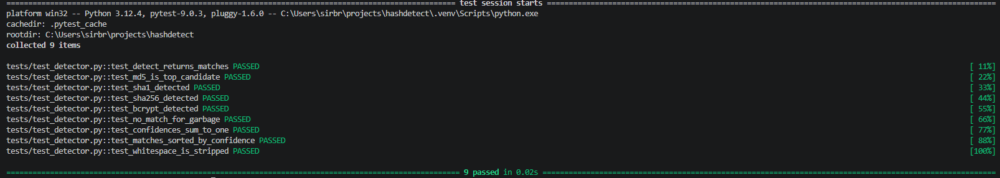
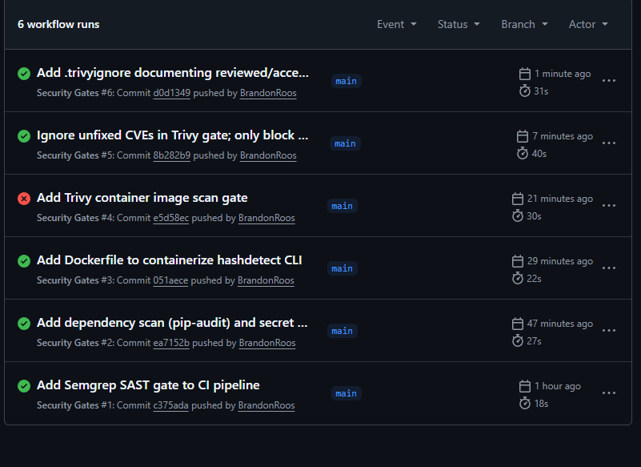
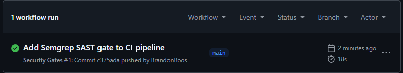
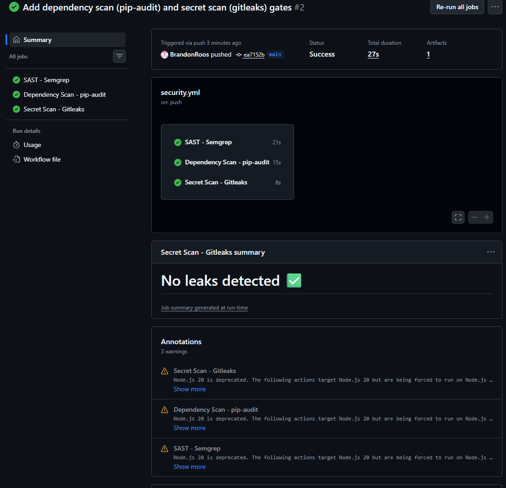
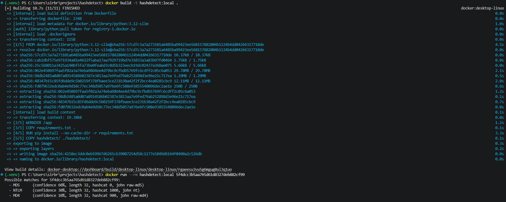
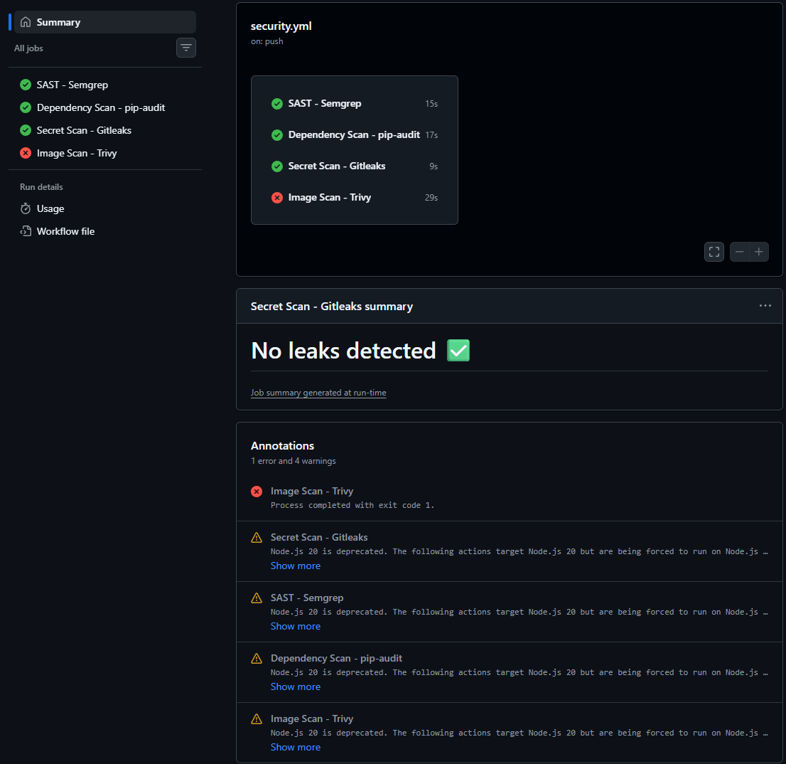

<div align="center">

# 🔎 hashdetect

### Hash Identification CLI · CI/CD Security Gate Pipeline

Python CLI that fingerprints hash types by length, charset, and structure — hardened by a GitHub Actions pipeline with four merge-blocking security gates (Semgrep SAST, pip-audit SCA, Gitleaks secret scanning, Trivy image scanning) and a documented CVE risk-acceptance policy.
<br>


</div>

<br>

This repository holds two pieces of work. The first is `hashdetect` itself: a small CLI that takes an unknown hash, reports every hash type whose shape it fits, ranks those candidates by confidence, and prints the corresponding [hashcat](https://hashcat.net/hashcat/) mode and [John the Ripper](https://www.openwall.com/john/) format so you can move straight into a cracking workflow.

The second is the security pipeline built around it. Four gates — SAST, dependency scan, secret scan, and container image scan — run on every push and pull request to `main` and fail the build on findings. The image-scan gate found 23 real vulnerabilities on its first run, and resolving them honestly (rather than switching the gate off) is the most interesting part of this project.

> **⌨️ Just want the tool?** Jump to [Usage](#usage).

> **🛡️ Here for the pipeline?** Jump to [Security pipeline](#security-pipeline), or straight to the [`.trivyignore` case study](#trivy-case-study).

---

## 🎯 Quick view

This project demonstrates:

- CI/CD security gating with GitHub Actions on push and pull request
- Static analysis (Semgrep), dependency auditing (pip-audit), secret detection (Gitleaks), and container image scanning (Trivy)
- Containerizing a CLI application with a cache-efficient Dockerfile
- Triaging real scanner output and separating patchable findings from unfixed upstream CVEs
- Documenting an accepted-risk decision in-repo as an auditable artifact rather than a silent toggle
- Python package structure, argument parsing, and a `pytest` suite

| Area | Evidence in this repository |
| --- | --- |
| Pipeline construction | Four gates added incrementally across six workflow runs, each verified green before the next |
| Gate enforcement | Trivy failed the build with exit code 1 on 23 real CVEs — the gate blocks, it does not just report |
| Vulnerability triage | All 23 findings confirmed to have no Fixed Version, traced to the Debian 13.6 base layer |
| Engineering judgment | [`.trivyignore`](.trivyignore) lists 12 accepted CVE IDs with a review date and rationale |
| Containerization | [`Dockerfile`](Dockerfile) built and run locally before being wired into the scan gate |
| Application quality | 9 `pytest` tests passing as the pre-pipeline baseline |

---

## 🧭 Navigation

- [Installation](#installation)
- [Usage](#usage)
- [How it works](#how-it-works)
- [Exit codes](#exit-codes)
- [Baseline: the existing test suite](#baseline)
- [Security pipeline](#security-pipeline)
- [The four gates](#four-gates)
- [Containerizing the CLI](#containerizing)
- [Case study: 23 CVEs and the `.trivyignore` decision](#trivy-case-study)
- [Design decisions](#design-decisions)
- [Reproduce the pipeline](#reproduce)
- [Limitations](#limitations)
- [What's next](#whats-next)
- [Lessons learned](LESSONS.md)

## 🗂️ Repository map

```text
hashdetect/
├── README.md
├── LESSONS.md
├── LICENSE
├── Dockerfile
├── .dockerignore
├── .trivyignore
├── requirements.txt
├── .github/
│   └── workflows/
│       └── security.yml
├── hashdetect/
│   ├── __init__.py
│   ├── __main__.py
│   ├── cli.py
│   ├── detector.py
│   └── signatures.py
├── tests/
│   └── test_detector.py
└── docs/
    └── screenshots/
```

---

<a id="the-tool"></a>

## 🔍 What the tool does

Given an unknown hash, `hashdetect` tells you what it's most likely to be — and, because many hash types share the same shape, it shows *all* plausible matches ranked by how common each type is in the wild.

- Detects 9 common hash types: MD5, SHA-1, SHA-224, SHA-256, SHA-384, SHA-512, NTLM, MD4, and bcrypt.
- Ranks ambiguous matches by confidence (e.g. a 32-character hex string could be MD5, NTLM, or MD4 — all three are shown, highest-likelihood first).
- Human-readable output by default; machine-readable JSON with `--json`.
- Accepts a single hash, a file of hashes, or piped input from stdin.
- Prints hashcat mode and John the Ripper format for each match.
- Proper exit codes for use in shell scripts.

<a id="installation"></a>

## 📦 Installation

Requires Python 3.10 or newer.

```bash
# Clone the repository
git clone https://github.com/BrandonRoos/hashdetect.git
cd hashdetect

# Create and activate a virtual environment
python -m venv .venv
# Windows (PowerShell):
.\.venv\Scripts\Activate.ps1
# macOS / Linux:
source .venv/bin/activate

# Install dependencies (only needed to run the tests)
pip install -r requirements.txt
```

The tool itself uses only the Python standard library, so no dependencies are required just to run it.

<a id="usage"></a>

## ⌨️ Usage

### Identify a single hash

```bash
python -m hashdetect 5f4dcc3b5aa765d61d8327deb882cf99
```

```
Possible matches for 5f4dcc3b5aa765d61d8327deb882cf99:
  - MD5      (confidence 60%, length 32, hashcat 0, john raw-md5)
  - NTLM     (confidence 30%, length 32, hashcat 1000, john nt)
  - MD4      (confidence 10%, length 32, hashcat 900, john raw-md4)
```

### Read hashes from a file

One hash per line:

```bash
python -m hashdetect -f hashes.txt
```

### Read from stdin (pipe)

```bash
# macOS / Linux
cat hashes.txt | python -m hashdetect

# Windows PowerShell
type hashes.txt | python -m hashdetect
```

### JSON output

Add `--json` to any of the above for structured output:

```bash
python -m hashdetect 5f4dcc3b5aa765d61d8327deb882cf99 --json
```

```json
[
  {
    "input": "5f4dcc3b5aa765d61d8327deb882cf99",
    "matches": [
      { "name": "MD5",  "confidence": 0.6, "length": 32, "hashcat_mode": 0,    "john_format": "raw-md5" },
      { "name": "NTLM", "confidence": 0.3, "length": 32, "hashcat_mode": 1000, "john_format": "nt" },
      { "name": "MD4",  "confidence": 0.1, "length": 32, "hashcat_mode": 900,  "john_format": "raw-md4" }
    ]
  }
]
```

### Help

```bash
python -m hashdetect --help
```

<a id="how-it-works"></a>

## ⚙️ How it works

Detection happens in two ways:

1. **Structural matching.** Hashes with a distinctive shape — like bcrypt's `$2b$12$...` format — are matched by a regular expression that captures their exact structure. These matches are unambiguous.

2. **Length and character-set matching.** Most raw hashes are just hex strings of a fixed length. A 64-character hex string, for example, could be SHA-256, but also SHA3-256, BLAKE2s, and others. `hashdetect` returns every signature that fits and ranks them.

Confidence is computed from a *prevalence* score assigned to each hash type (how often it appears in practice). Each match's confidence is its prevalence divided by the total prevalence of all matching types, so the scores for a given input always sum to 100%.

<a id="exit-codes"></a>

## 🔢 Exit codes

| Code | Meaning |
|------|---------|
| 0 | At least one match found (or JSON mode, which always exits 0) |
| 1 | No known hash type matched the input (text mode) |
| 2 | No input provided (no hash, no `-f`, no piped stdin) |

<a id="baseline"></a>

## 🧪 Baseline: the existing test suite

The CLI and its `pytest` suite predate the security pipeline. Before adding any CI/CD work, I captured the starting state: 9 tests, all passing.

```bash
pytest -v
```



This is the application's own test suite, not a security gate. It is the "before" picture — everything from this point on is pipeline work layered on top of a codebase that already worked. Note that the pipeline described below does **not** currently run `pytest`; the four gates are security checks, and adding a test job is listed under [What's next](#whats-next).

---

<a id="security-pipeline"></a>

## 🛡️ Security pipeline

[`.github/workflows/security.yml`](.github/workflows/security.yml) defines four independent jobs that run on every push and pull request to `main`. Each one fails the workflow on findings, so a run that goes red blocks the merge rather than filing a warning nobody reads.

The gates were added one at a time, each verified green before the next went in. That history is visible in the Actions tab, including the run where Trivy correctly failed on real CVEs and the two commits that followed it.



| # | Gate | Tool | Scope | Fails the build on |
| --- | --- | --- | --- | --- |
| 1 | SAST | `semgrep/semgrep-action@v1` | Repository source, `p/default` ruleset | Any rule match |
| 2 | Dependency scan | `pip-audit` | `requirements.txt` | Any known-vulnerable pinned dependency |
| 3 | Secret scan | `gitleaks/gitleaks-action@v2` | Full git history (`fetch-depth: 0`) | Any detected secret |
| 4 | Image scan | `aquasecurity/trivy-action@v0.36.0` | `hashdetect:ci` container image | `CRITICAL,HIGH` findings, `exit-code: 1` |

All four checks — `SAST - Semgrep`, `Dependency Scan - pip-audit`, `Secret Scan - Gitleaks`, and `Image Scan - Trivy` — are configured as required status checks under GitHub branch protection on `main`, so a pull request cannot be merged until every one of them passes. I verified this with a test PR: the merge button stayed disabled while the checks were pending. That rule is what makes "blocks the merge" literal rather than just "the check goes red."

<a id="four-gates"></a>

## 🚦 The four gates

### 1. SAST — Semgrep

The first gate, and the first workflow run in the repository. Semgrep runs its `p/default` ruleset against the source and fails on any match.

```yaml
- name: Run Semgrep
  uses: semgrep/semgrep-action@v1
  with:
    config: p/default
```



Starting with a single job kept the feedback loop tight — a red run at this stage could only have been the gate I had just added.

### 2. Dependency scan — pip-audit

`pip-audit` checks the pinned packages in [`requirements.txt`](requirements.txt) against the Python advisory database. The job installs a fixed Python version first so results are reproducible rather than tied to whatever the runner image ships.

```yaml
- name: Run pip-audit
  run: pip-audit -r requirements.txt
```

`requirements.txt` covers the test tooling (`pytest` and its transitive dependencies plus `colorama`); the tool itself is standard-library only, which keeps this surface small by design.

### 3. Secret scan — Gitleaks

Gitleaks scans for committed credentials. The important detail is the checkout:

```yaml
- name: Checkout code
  uses: actions/checkout@v4
  with:
    fetch-depth: 0
```

The default shallow checkout would only give Gitleaks the latest commit. A secret that was committed and later removed would still be in the history, still be retrievable, and still need rotating — but a shallow scan would never see it. `fetch-depth: 0` fetches the full history so the scan covers every commit in the repository.



### 4. Image scan — Trivy

Trivy scans the built container image for OS and library vulnerabilities and exits non-zero on anything `HIGH` or `CRITICAL`. This is the gate that found real problems, so it gets its own [case study](#trivy-case-study) below — but it depends on there being an image to scan in the first place.

---

<a id="containerizing"></a>

## 🐳 Containerizing the CLI

`hashdetect` is a command-line tool, not a web service, and nothing about it needs to be deployed. The [`Dockerfile`](Dockerfile) exists for one reason: **to give the image-scanning gate something to scan.** Treating it as evidence of a deployed service would be a misreading.

```dockerfile
FROM python:3.12-slim

WORKDIR /app

COPY requirements.txt .
RUN pip install --no-cache-dir -r requirements.txt

COPY hashdetect/ ./hashdetect/

ENTRYPOINT ["python", "-m", "hashdetect"]
```

The ordering is deliberate. `COPY requirements.txt` and `RUN pip install` come **before** `COPY hashdetect/` so that the dependency-install layer is cached independently of the source. Editing a `.py` file invalidates only the final `COPY`; the install layer is reused. Copying the source first would bust the cache and reinstall every dependency on every rebuild — the single most common Dockerfile inefficiency, and one the CI job pays for on every run.

[`.dockerignore`](.dockerignore) keeps `.git/`, `.github/`, `tests/`, `.venv/`, and bytecode caches out of the build context.

I built and ran the image locally before wiring it into the workflow, confirming the containerized CLI produced the same output as the local install:



The CI job builds the same image as `hashdetect:ci` and hands it to Trivy:

```yaml
- name: Build image
  run: docker build -t hashdetect:ci .

- name: Run Trivy vulnerability scanner
  uses: aquasecurity/trivy-action@v0.36.0
  with:
    image-ref: hashdetect:ci
    format: table
    exit-code: '1'
    severity: CRITICAL,HIGH
```

---

<a id="trivy-case-study"></a>

## 🔬 Case study: 23 CVEs and the `.trivyignore` decision

### Initial result

The first run of the Trivy gate failed. Four jobs, three green, one red: `Image Scan - Trivy` — `Process completed with exit code 1`.



The scan reported **23 vulnerabilities: 19 HIGH and 4 CRITICAL**. That is exactly what a gate is supposed to do, and the failure is the proof that this pipeline enforces rather than reports. But a red build on `main` is only useful if it can be resolved honestly.

### Root cause

None of the 23 findings were in my code. All of them were in the `python:3.12-slim` base layer — Debian 13.6 system packages, largely Debian and Perl components pulled in by the base image.

The decisive detail came from Trivy's own output. Its table includes a **Fixed Version** column, and for all 23 findings that column was empty. These were not out-of-date packages that a rebuild would clear; they were unresolved upstream CVEs with no patch published at the time of the scan. Rebuilding, repinning, or bumping the base tag would have changed nothing.

That reframed the problem. The question was no longer "how do I fix these" — there was nothing to fix — but "how do I record that I looked at them, understood them, and accepted them."

### First fix attempt — `ignore-unfixed`

The Trivy action exposes an `ignore-unfixed` input intended to drop exactly this class of finding, so I tried it first:

```yaml
ignore-unfixed: true
```

It did not do what I needed. Re-running the gate produced the same 23 findings in the Trivy output rather than the filtered result I expected. Rather than keep debugging the action's handling of that input, I stepped back and asked what I actually wanted from the fix — and concluded that a workflow toggle was the wrong shape for the decision anyway.

### Final approach — an explicit `.trivyignore`

I removed `ignore-unfixed` from the workflow and added a [`.trivyignore`](.trivyignore) at the repository root listing the accepted CVE IDs, with a header recording the review date and the reasoning:

```text
# Unfixed upstream Debian/Perl CVEs in python:3.12-slim base image (debian 13.6)
# Reviewed 2026-08-01: confirmed no Fixed Version available via Trivy's own output.
# Re-check on next base image rebuild / before production use.

CVE-2026-53615
CVE-2026-41992
...
```

The 23 findings collapse to **12 unique CVE IDs**, because several packages share the same CVE — `CVE-2026-53615`, for example, affects five packages built from the same `util-linux` source. The file lists the 12 identifiers, not the 23 package-level rows.

**This is a better outcome than the original plan, not a workaround for it.** `ignore-unfixed: true` is a blanket toggle: it silently suppresses an unbounded, invisible set of findings, and nothing in the repository records what was suppressed or who decided it was acceptable. `.trivyignore` inverts that. Anyone reading this repository — a reviewer, an auditor, or me in six months — can see the exact list of accepted CVEs, the date they were reviewed, and the stated reason. The decision lives in version control, so changing it requires a commit.

### Validation

With `.trivyignore` in place, the gate went green — and it is still a live gate, not a disabled one. The ignore list is an enumeration of twelve specific identifiers, so:

- A **new** CVE in the base image that is not on the list will fail the build, exactly as intended.
- When upstream publishes fixes for any of the twelve, rebuilding on a patched base and removing those lines restores enforcement for them.
- The header's re-check instruction ties the accepted risk to a review date rather than leaving it open-ended.

The last two runs in the [history above](#security-pipeline) show the resolution: the `.trivyignore` commit passing all four gates.

---

<a id="design-decisions"></a>

## 🧯 Design decisions

### Why the severity scope is `CRITICAL,HIGH` only

`severity: CRITICAL,HIGH` is a deliberate noise-reduction choice, not an oversight. A `python:3.12-slim` base image carries a long tail of `LOW` and `MEDIUM` findings, most of which are unreachable from a CLI that reads a string and prints a table. Gating on all four severities would have produced a build that is red by default, and a permanently red build gets ignored — which is worse than no gate. Scoping to `CRITICAL,HIGH` keeps a red run meaningful.

### Why Gitleaks scans the full history

Secrets are not made safe by deleting them in a later commit; they remain in the history and must be treated as compromised until rotated. Scanning only the tip commit would report clean on a repository that still leaks. `fetch-depth: 0` costs a slower checkout and buys a scan that reflects reality.

### Why a CLI has a Dockerfile

Container image scanning is a standard gate in a real pipeline, and I wanted the pipeline to include one. `hashdetect` had no image, so I built one specifically to be scanned. The container is a scan target and a convenient way to run the tool without a local Python setup — it is not evidence of a deployed service, and this README does not claim otherwise.

---

<a id="reproduce"></a>

## ♻️ Reproduce the pipeline

Every piece of the pipeline is a small file at the repository root or under `.github/`. Dropping these four into another Python project gives you the same four gates.

| Artifact | Purpose |
| --- | --- |
| [`.github/workflows/security.yml`](.github/workflows/security.yml) | The four gate jobs, triggered on push and PR to `main` |
| [`Dockerfile`](Dockerfile) | Builds the image that the Trivy gate scans |
| [`.dockerignore`](.dockerignore) | Keeps `.git/`, `tests/`, and caches out of the build context |
| [`.trivyignore`](.trivyignore) | Documented, dated accept-list of unfixed base-image CVEs |

Two things to adjust before reusing them: the `.trivyignore` list is specific to the base image and the date it was reviewed — it should be re-derived, not copied — and `pip-audit -r requirements.txt` assumes pinned requirements at the repository root.

Run the container locally without cloning a Python environment:

```bash
docker build -t hashdetect:local .
docker run --rm hashdetect:local 5f4dcc3b5aa765d61d8327deb882cf99
```

## 🖼️ Evidence

Screenshots of every run referenced above are in [`docs/screenshots/`](docs/screenshots/), including the full Actions history, the failing Trivy gate, the Gitleaks summary, and the local container build.

---

<a id="limitations"></a>

## ⚠️ Limitations

- **`hashdetect` identifies hashes by shape, not content.** It cannot verify that a string is genuinely a hash of a given type — only that it *could* be, based on length and pattern. A 32-character hex string is reported as a possible MD5 because it has the right form, not because the tool has confirmed it was produced by MD5. Treat the output as a ranked set of hypotheses, not a definitive answer.
- The pipeline gates on security only. `pytest` is not yet part of the workflow, so the 9 tests are run manually.
- `.trivyignore` reflects a point-in-time review dated 2026-08-01. It is accurate for the base image scanned that day and needs re-checking on any base image change.
- Semgrep's `p/default` ruleset is a broad baseline, not a Python-specific or project-tuned configuration.
- The container is a scan target and a convenience wrapper. It has not been hardened for production use — it still runs as root and is built on a general-purpose slim base.
- Gate results come from GitHub-hosted runners on a public repository; nothing here has been validated in a private or self-hosted CI environment.

<a id="whats-next"></a>

## 🚀 What's next

- Add a `pytest` job to the workflow so the test suite gates merges alongside the security scans.
- Add a non-root `USER` to the Dockerfile and evaluate a distroless or Alpine base to shrink the CVE surface.
- Re-run Trivy against a rebuilt base image and prune any of the 12 CVEs that have since been patched.
- Swap `p/default` for a tuned Semgrep ruleset with Python-specific rules.
- Upload Trivy and Semgrep results as SARIF so findings surface in the GitHub Security tab rather than only in job logs.
- Pin the remaining actions by commit SHA rather than tag.

## 📓 Lessons learned

[`LESSONS.md`](LESSONS.md) records the errors hit while building the tool itself — import-path mistakes, git configuration problems, and debugging habits — written up as they happened.

## ⚖️ Disclaimer

This tool is intended for legitimate security work — penetration testing, forensics, CTFs, and education — on systems and data you own or are authorized to test. You are responsible for complying with all applicable laws.

## 📄 License

This project is licensed under the MIT License — see the [LICENSE](LICENSE) file for details.

---

<div align="center">

*A hash identification CLI, and the security pipeline built around it · [Lessons learned](LESSONS.md) · [Evidence](docs/screenshots/)*

</div>
